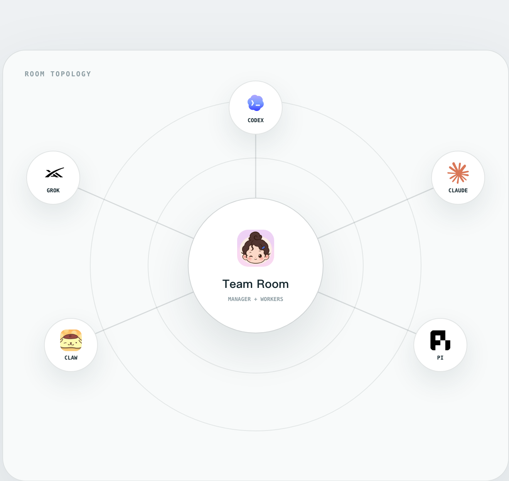

# PuddingTeams

**把不同 Agent 拉进同一间房，让目标、过程与交付持续可见。**

<p align="center">
  
</p>

PuddingTeams 是一个本地优先的多 Agent 协作系统。它不是“同时打开几个聊天窗口”，而是把共同目标、Manager 计划、Worker 执行、人的决策与 Workspace 交付保存在一条可恢复的协作链上。

Agent 可以更换，项目和协作状态仍归用户；一次执行可以中断，Session、Goal、证据和产物不会随进程一起消失。

[产品介绍](https://puddingai.com/products/teams/) · [在线文档](https://teams.puddingai.com/docs/) · [本地文档开发](#文档)

> **当前阶段：Preview。** 核心协作链、第一方 Connector、桌面构建和源码运行已经可用；通用 HTTP Transport、隔离 Extension Host 与社区安装市场仍在开发边界内。

## 为什么需要 PuddingTeams

一次模型调用只能生成一次响应，持续工程工作还需要回答这些问题：

- 谁在负责当前目标，谁只是执行其中一步？
- 多个 Agent 怎样共享进度，又不相互伪造上下文？
- 会话中断后，怎样从原来的 Goal、Workspace 和执行状态继续？
- 长结果、证据和最终交付放在哪里，怎样被引用和验收？
- 更换 Agent 或 Connector 后，项目状态是否仍然属于用户？

PuddingTeams 的答案是：**协作状态属于平台，执行协议属于 Connector，具体 Agent 可以替换。**

## 核心模型

| 对象 | 作用 |
| --- | --- |
| Window | 保存一段长期协作关系：solo、单聊或群聊 |
| Session | 保存 Window 中一段可继续的对话与执行历史 |
| Goal | 定义当前结果、完成条件和复核边界 |
| Delegation | 记录谁在什么时候执行了哪次委托 |
| Workspace | 绑定真实工作目录、信任状态与路径快照 |
| Artifact | 登记可引用、可验收的结果、证据和冻结快照 |

Manager 负责理解目标、拆分工作和统一验收；Worker 保留自己的运行时、会话句柄与工具。平台用明确的 Delegation 和 Artifact 把它们连接起来，而不是依靠复制粘贴聊天记录维持“协作感”。

## 三种协作方式

| 模式 | 消息首先交给谁 | 适合 |
| --- | --- | --- |
| **Solo** | pi Manager | 只知道目标，希望系统选择 Agent、拆分并组队 |
| **单聊** | 唯一 Worker | 已经明确执行者，需要与同一个 Agent 持续工作 |
| **群聊** | pi Manager | 多个专业角色共享 Goal，进行并行、接力和统一验收 |

单聊不经过 Manager 转发；群聊中的 Worker 也不会假装共享同一份模型上下文。共同事实通过 Room、Goal、WorkPlan、Decision、Delegation 和 Artifact 持久化。

## Agent 与 Connector

PuddingTeams 通过统一 Driver 语义连接不同执行端：

| Connector | Transport | 当前状态 |
| --- | --- | --- |
| Pi | SDK | 已实现；既可作为 Manager Harness，也可作为本地 Worker |
| Codex | Spawn | 第一方预装 Connector |
| Claude Code | Spawn | 第一方预装 Connector |
| PuddingClaw | Spawn | 第一方预装 Connector |
| 自定义 Agent | Extension | 可通过 manifest、Driver 和 Connector contribution 接入 |
| HTTP Agent | HTTP | 契约已预留，通用 Transport 尚未实现 |

Driver 将上游协议归一成 `run`、`continue`、`respond` 和 `cancel`。Window、Goal 与 UI 不需要理解每个 CLI 或 SDK 的私有事件。

## 快速开始

### 源码开发

要求 Node.js 20+ 与 pnpm 10.32.1：

```bash
corepack enable
pnpm install
pnpm dev
```

开发态会启动：

- Server API：`http://127.0.0.1:8933`
- Next.js Web：`http://127.0.0.1:8934`

然后按实际使用的 Worker 准备对应依赖：Codex CLI、Claude Code CLI 或 PuddingClaw CLI 及其登录态；pi 代码随项目依赖安装，但模型凭据仍需配置。

### 生产源码运行

```bash
pnpm install
pnpm build:runtime
node packages/puddingteams-cli/bin/puddingteams.js start
```

默认数据目录是 `~/.puddingteams`，生产 Server 默认只监听 `127.0.0.1:8933`。初始化和只读体检：

```bash
node packages/puddingteams-cli/bin/puddingteams.js init
node packages/puddingteams-cli/bin/puddingteams.js doctor
```

### 桌面 App

桌面 App 内置 PuddingTeams 的 Node Runtime、Web 与第一方 Connector 代码，但不会替你安装所有外部 Agent CLI，也不会接管它们的账号和凭据。

```bash
# macOS
pnpm build:electron

# macOS arm64
pnpm build:electron:arm64

# Windows x64（在 Windows 构建环境运行）
pnpm build:electron:win:x64
```

完整依赖、数据目录、多实例和远程部署边界见[部署文档](https://teams.puddingai.com/docs/deployment/)。

## Harness 能力

- **长结果落盘**：超出消息预算的结果外置到本地文件，通过摘要、路径、哈希和分页回读继续使用。
- **Session Goal**：把目标、完成条件、状态与复核从提示词提升为持久对象。
- **可恢复执行**：保存 Worker `sessionHandle`、委托边界与交互状态，支持 continue、respond、cancel 和故障恢复。
- **HITL 决策**：Agent 的输入请求、人的审批和最终结论留在同一条执行时间线上。
- **Workspace 交付**：每次协作绑定明确工作目录，Artifact 可以被登记、引用和验收。

## 文档

文档属于 PuddingTeams 仓库自身，位于 [`apps/docs`](apps/docs)，与官网和其他项目文档解耦。

- [PuddingTeams 是什么](https://teams.puddingai.com/docs/)
- [技术架构](https://teams.puddingai.com/docs/architecture/)
- [部署方式](https://teams.puddingai.com/docs/deployment/)
- [协作模式](https://teams.puddingai.com/docs/room/)
- [Harness 与长结果](https://teams.puddingai.com/docs/harness/)
- [Session Goal](https://teams.puddingai.com/docs/goals/)
- [Extension 机制](https://teams.puddingai.com/docs/connectors/)
- [Connector 开发参考](https://teams.puddingai.com/docs/connector-development/)
- [运行与排错](https://teams.puddingai.com/docs/operations/)

本地启动文档站：

```bash
pnpm docs:dev
```

默认访问 `http://127.0.0.1:8936/docs/`。

## 仓库结构

```text
apps/
  server/                Fastify API、WebSocket、Agent Runtime 与状态存储
  web/                   Next.js / React 协作界面
  docs/                  独立文档网站及 MDX 内容
electron/                桌面宿主与发行构建
extensions/
  connectors/            第一方 Connector
  capabilities/          可复用 Capability
  shared/                Extension 共享契约
packages/
  puddingteams-cli/      CLI 与生产 runtime 入口
docs/                    工程设计、协议与实现参考
scripts/                 构建、端口清理和验证脚本
```

## 当前边界

- 默认安全模型是本机单用户与 loopback 访问；不要直接把 Server 端口暴露到公网。
- Extension 代码当前仍在 Server 进程内执行，开发者模式不是安全沙箱。
- HTTP、RPC 与 ACP 目前是能力词汇或预留契约，不代表平台已经提供通用 Transport。
- 当前 CLI 包标记为 private，README 不承诺公共 npm 安装渠道。

如果你要了解“现在已经实现了什么”，以代码和[当前实现状态](https://teams.puddingai.com/docs/#当前实现状态)为准；如果你要接入新的 Agent，从 [Connector 开发参考](https://teams.puddingai.com/docs/connector-development/)开始。
